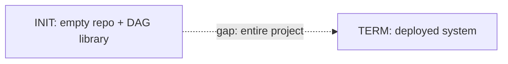
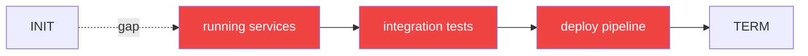
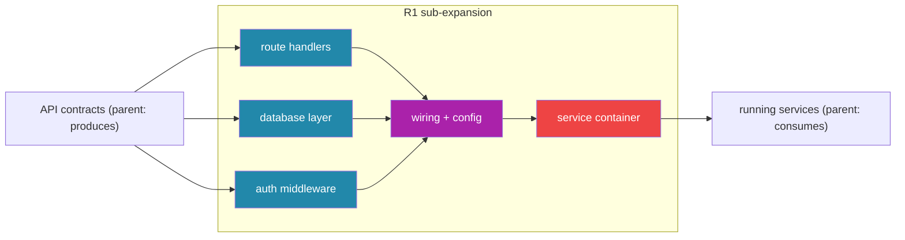
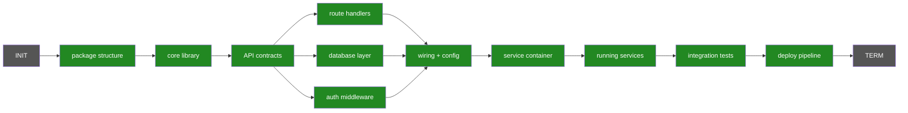

# DAG-Governed Recursive Expansion Protocol

## The Protocol

```
STATES:
  SEED      → initial. nodes: {INIT, TERM}. edges: none. gap: total.
  EXPAND    → propose nodes from one end. each node declares {produces, consumes, provisions}.
  FLIP      → propose nodes from the opposite end. must narrow the gap.
  RECONCILE → for each forward node F and backward node B: does F.produces satisfy B.consumes?
  LEAF      → connection is concrete. node has typed contract + proven path. implementable.
  RECURSE   → connection is coarse. node becomes sub-DAG. inherits {entry: parent.produces, exit: parent.consumes}.
  DONE      → every node is forward-reachable AND backward-traceable.

TRANSITIONS:
  SEED      → EXPAND
  EXPAND    → FLIP
  FLIP      → RECONCILE
  RECONCILE → LEAF        when: connection found, edge is concrete
  RECONCILE → RECURSE     when: connection found, edge is coarse
  RECONCILE → EXPAND      when: no connection (gap remains)
  RECURSE   → EXPAND      (re-enter at finer scope with inherited boundary constraints)
  LEAF      → DONE        when: all nodes are leaves
  LEAF      → EXPAND      when: unexpanded nodes remain

INVARIANTS:
  - every EXPAND commit adds nodes + edges, never removes
  - every RECONCILE commit adds edges between existing forward and backward nodes
  - every RECURSE commit replaces one coarse node with a sub-DAG preserving its boundary contract
  - DONE is unreachable until: for all nodes N, reachable(INIT, N) AND reachable(N, TERM)
```

Every agent action is a state transition. Every git commit is exactly one of: EXPAND, FLIP, RECONCILE, RECURSE.

## Thesis

LLMs are probabilistic transformations in graph state. The best governance structure for probabilistic transformation is a DAG — mirroring how Git tracks history as a DAG of committed facts.

The roadmap DAG works in two directions simultaneously:
- **Forward from initial state** (speculation — what can we build next?)
- **Backward from terminal state** (intent — what must exist?)

Reconciliation is where the two directions meet. Recursive expansion deepens both frontiers until every leaf is both reachable from the start and traceable to the terminal state.

## The Graph

### Level 0 — Seed

Two nodes. The gap between them is the entire project.



### Level 1 — First Backward Expansion

Ask: "What must exist immediately before TERM?"



Red = backward frontier. These nodes are traceable to TERM but not yet reachable from INIT.

### Level 1 — First Forward Expansion

Ask: "What can we build first given INIT?"

```mermaid
graph LR
    INIT["INIT"]
    F1["package structure"]
    F2["core library"]
    F3["API contracts"]
    B3["running services"]
    B2["integration tests"]
    B1["deploy pipeline"]
    TERM["TERM"]

    INIT --> F1
    F1 --> F2
    F2 --> F3

    F3 -..->|"gap"| B3

    B3 --> B2
    B2 --> B1
    B1 --> TERM

    style F1 fill:#28a,color:#fff
    style F2 fill:#28a,color:#fff
    style F3 fill:#28a,color:#fff
    style B1 fill:#e44,color:#fff
    style B2 fill:#e44,color:#fff
    style B3 fill:#e44,color:#fff
```



Blue = forward frontier. The gap has narrowed: it's now between F3 and B3.

### Level 1 — Reconciliation

Ask: "Do F3 and B3 share a contract?"

F3 produces API contracts. B3 consumes API contracts to run services. **Connection found.** But the edge needs proof — what transforms contracts into running services?

```mermaid
graph LR
    INIT["INIT"]
    F1["package structure"]
    F2["core library"]
    F3["API contracts"]
    R1["service implementations"]
    B3["running services"]
    B2["integration tests"]
    B1["deploy pipeline"]
    TERM["TERM"]

    INIT --> F1
    F1 --> F2
    F2 --> F3
    F3 --> R1
    R1 --> B3
    B3 --> B2
    B2 --> B1
    B1 --> TERM

    style F1 fill:#28a,color:#fff
    style F2 fill:#28a,color:#fff
    style F3 fill:#28a,color:#fff
    style R1 fill:#a2a,color:#fff
    style B1 fill:#e44,color:#fff
    style B2 fill:#e44,color:#fff
    style B3 fill:#e44,color:#fff
```



Purple = reconciled node. The full path from INIT to TERM is now connected. But R1 ("service implementations") is coarse — it needs sub-expansion.

### Level 2 — Recurse Into R1

R1 becomes a sub-DAG. Same protocol, smaller scope.



The sub-DAG inherits boundary constraints from its parent:
- **Entry**: must consume what F3 produces (API contracts)
- **Exit**: must produce what B3 consumes (running services)

Sub-expansion continues until every leaf declares concrete produces/consumes that map to files, exports, or infra resources.

### Termination



Green = every node is both forward-reachable and backward-traceable. Each is a leaf with a typed contract. The graph is fully reconciled. Implementation can begin at any leaf whose dependencies are satisfied.

## Node Contract

Every node in the graph declares:

```
produces:  what artifacts this step creates (files, exports, infra)
consumes:  what artifacts this step requires (from DAG predecessors)
provisions: what infrastructure this step stands up
```

The TypeScript type system enforces that `consumes` references resolve to `produces` declarations in predecessor nodes. An orphaned reference is a compile error.

## Commit Types

Every git commit is one of:

| Type | What it does | DAG effect |
|------|-------------|------------|
| **Expansion** | Decomposes a node into a sub-DAG | Adds nodes + edges, preserves boundary contracts |
| **Implementation** | Fills a leaf with code/infra | No structural change, produces artifacts |
| **Reconciliation** | Proves two frontiers connect | Adds edges between forward and backward nodes |

## Formalization Gradient

**Day 1**: nodes are prose ("auth middleware"). Produces/consumes are strings. The graph reads like a prompt.

**Day N**: nodes have typed contracts matching real exports. Produces/consumes reference actual file paths and function signatures. The prompt compiled itself into a schema.

No phase transition. Continuous refinement. `tsc --noEmit` validates at every step. The type system ratchets — formal never backslides to vague.

## Bootstrap

```
repo/
  package.json    # deps: dag library (roadmap-schema, algorithms, git-roadmap-state)
  roadmap.ts      # INIT + TERM + first expansion cycle
```

## Why A DAG

A prompt drifts. A DAG compiles.

Same structure viewed from different angles:
- **Prompt**: tells the agent what to do next
- **Build graph**: tells the compiler what order to build
- **IaC declaration**: tells the provisioner what infra to create
- **Governance contract**: tells the adversarial layer what to verify

## Expansion Cycle Type

```typescript
type ExpansionCycle = {
  direction: 'forward' | 'backward';
  frontier: PhaseSpec[];           // what this expansion produced
  counterpart: PhaseSpec[];        // what the other direction produced
  reconciled: Connection[];        // proven links between frontiers
  gaps: UnresolvedGap[];           // recurse into these
};
```

Each committed expansion is a git commit. Each reconciliation is a commit. The git history IS the convergence trace.
